# GeoFlight Planner - Documentación Técnica Completa

Sistema de planificación de vuelos fotogramétricos para drones DJI Mini 4 Pro y Mini 5 Pro. Genera misiones exportables en formato KMZ compatible con DJI Fly.

---

## Tabla de Contenidos

- [Arquitectura General](#arquitectura-general)
- [Flujo de Datos Completo](#flujo-de-datos-completo)
- [Backend (FastAPI)](#backend-fastapi)
  - [API Endpoints](#api-endpoints)
  - [Modelos de Datos](#modelos-de-datos)
  - [Calculador Fotogramétrico](#calculador-fotogramétrico)
  - [Generador WPML](#generador-wpml)
  - [Empaquetador KMZ](#empaquetador-kmz)
- [Patrones de Vuelo](#patrones-de-vuelo)
  - [Grid (Serpentín)](#1-grid-serpentín)
  - [Double Grid (Cuadrícula Doble)](#2-double-grid-cuadrícula-doble)
  - [Corridor (Corredor)](#3-corridor-corredor)
  - [Orbit (Órbita)](#4-orbit-órbita)
- [Frontend (React + TypeScript)](#frontend-react--typescript)
  - [Componentes](#componentes)
  - [Hook useMission](#hook-usemission)
  - [Servicios API](#servicios-api)
- [Parámetros Fotogramétricos](#parámetros-fotogramétricos)
- [Formato DJI WPML](#formato-dji-wpml)
- [Instalación y Configuración](#instalación-y-configuración)

---

## Arquitectura General

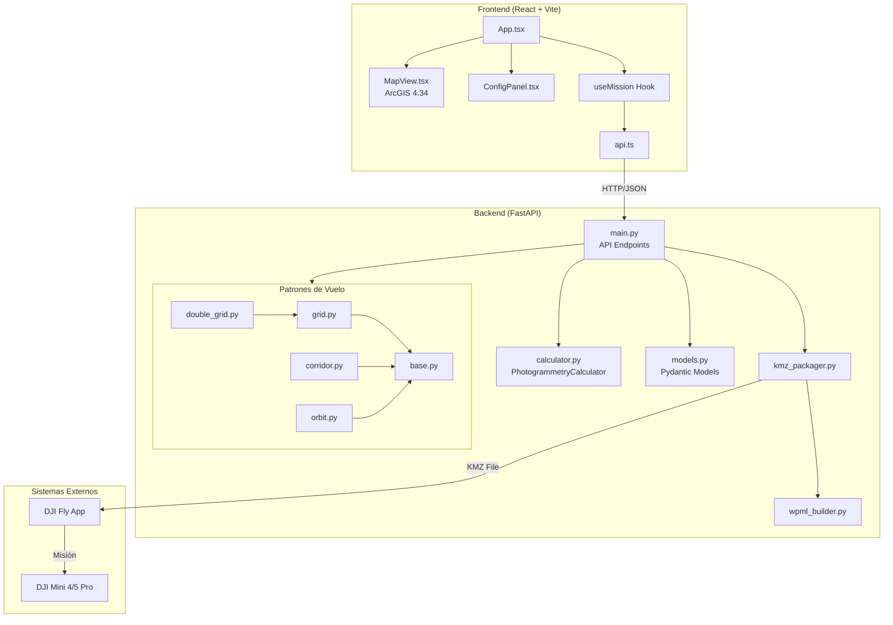

---

## Flujo de Datos Completo

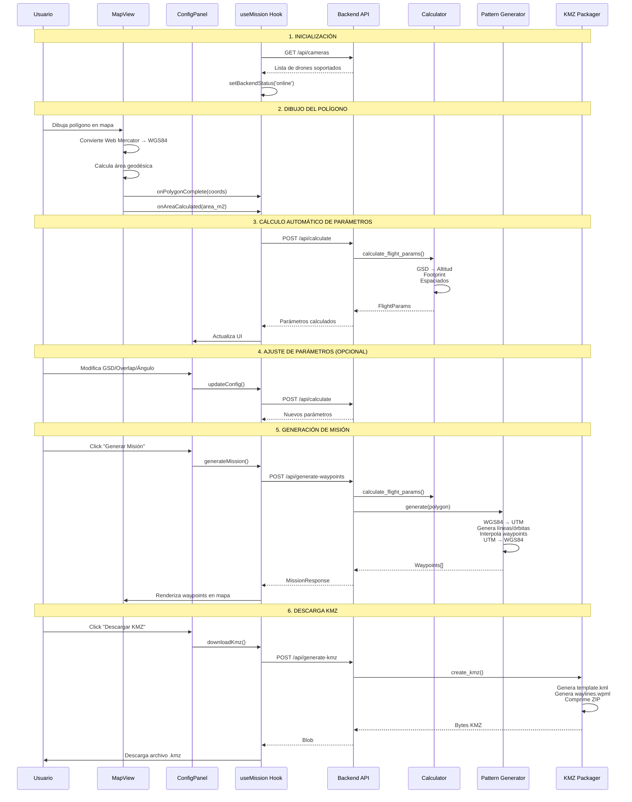

---

## Backend (FastAPI)

### API Endpoints

```mermaid
flowchart LR
    subgraph Endpoints
        E1["GET /api/cameras"]
        E2["POST /api/calculate"]
        E3["POST /api/generate-waypoints"]
        E4["POST /api/generate-kmz"]
        E5["GET /health"]
    end

    E1 -->|"Lista drones"| R1[CameraListResponse]
    E2 -->|"Solo cálculos"| R2[FlightParams]
    E3 -->|"Waypoints"| R3[MissionResponse]
    E4 -->|"Archivo"| R4[Binary KMZ]
    E5 -->|"Estado"| R5[{"status": "healthy"}]
```

| Endpoint | Método | Descripción | Request | Response |
|----------|--------|-------------|---------|----------|
| `/api/cameras` | GET | Lista drones soportados | - | `CameraListResponse` |
| `/api/calculate` | POST | Calcula parámetros sin waypoints | `CalculateRequest` | `FlightParams` |
| `/api/generate-waypoints` | POST | Genera waypoints completos | `MissionRequest` | `MissionResponse` |
| `/api/generate-kmz` | POST | Genera y descarga KMZ | `MissionRequest` | `Binary` |
| `/health` | GET | Health check | - | `{"status": "healthy"}` |

---

### Modelos de Datos

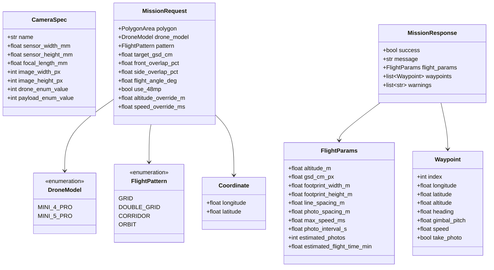

#### Especificaciones de Cámaras

| Drone | Sensor | Focal | Resolución | Enum DJI | Intervalo |
|-------|--------|-------|------------|----------|-----------|
| Mini 4 Pro | 9.59 × 7.19 mm | 6.72 mm | 8064 × 6048 px | 68/52 | 2s (12MP), 5s (48MP) |
| Mini 5 Pro | 9.59 × 7.19 mm | 6.72 mm | 8064 × 6048 px | 91/80 | 2s (12MP), 5s (48MP) |

---

### Calculador Fotogramétrico

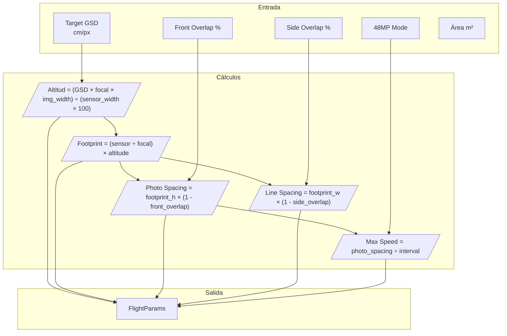

#### Fórmulas Principales

| Parámetro | Fórmula |
|-----------|---------|
| **Altitud** | `(GSD × focal_mm × image_width_px) / (sensor_width_mm × 100)` |
| **GSD** | `(sensor_width_mm × altitude_m × 100) / (focal_mm × image_width_px)` |
| **Footprint Width** | `(sensor_width_mm / focal_mm) × altitude_m` |
| **Footprint Height** | `(sensor_height_mm / focal_mm) × altitude_m` |
| **Photo Spacing** | `footprint_height × (1 - front_overlap / 100)` |
| **Line Spacing** | `footprint_width × (1 - side_overlap / 100)` |
| **Max Speed** | `photo_spacing / photo_interval` |

#### Ejemplo de Cálculo (GSD 2 cm/px, Mini 4 Pro)

```
Altitud    = (2 × 6.72 × 8064) / (9.59 × 100) = 112.8 m
Footprint  = (9.59/6.72) × 112.8 = 161.0 m ancho × 120.7 m alto
Photo Spacing (75% overlap) = 120.7 × 0.25 = 30.2 m
Line Spacing (65% overlap)  = 161.0 × 0.35 = 56.4 m
Max Speed (12MP, 2s)        = 30.2 / 2 = 15.1 m/s
```

---

### Generador WPML

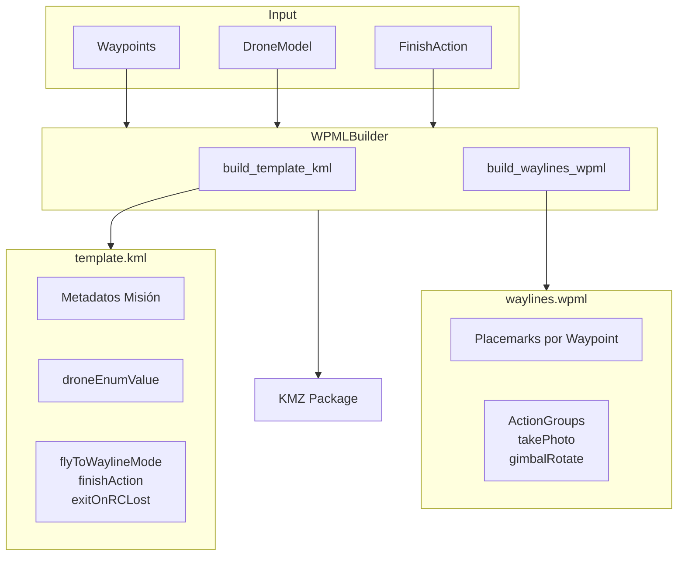

#### Estructura del Waypoint en WPML

```xml
<Placemark>
  <Point>
    <coordinates>-74.0075,4.7110</coordinates>
  </Point>
  <wpml:index>0</wpml:index>
  <wpml:executeHeight>112.8</wpml:executeHeight>
  <wpml:waypointSpeed>10.0</wpml:waypointSpeed>
  <wpml:waypointHeadingParam>
    <wpml:waypointHeadingMode>followWaylineDirection</wpml:waypointHeadingMode>
  </wpml:waypointHeadingParam>
  <wpml:actionGroup>
    <wpml:action>
      <wpml:actionActuatorFunc>takePhoto</wpml:actionActuatorFunc>
    </wpml:action>
    <wpml:action>
      <wpml:actionActuatorFunc>gimbalRotate</wpml:actionActuatorFunc>
      <wpml:gimbalPitchRotateAngle>-90</wpml:gimbalPitchRotateAngle>
    </wpml:action>
  </wpml:actionGroup>
</Placemark>
```

---

### Empaquetador KMZ

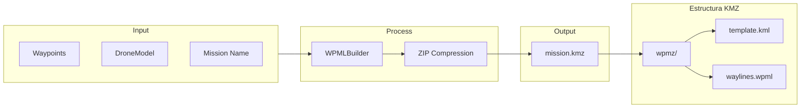

---

## Patrones de Vuelo

### 1. Grid (Serpentín)

Patrón de barrido en líneas paralelas con giros alternados. Ideal para fotogrametría general de áreas.

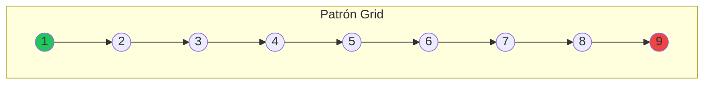

```
   ┌─────────────────────────────────┐
   │  1 ──→ 2 ──→ 3 ──→ 4 ──→ 5    │  Línea 1 →
   │                          │      │
   │                          ↓      │
   │  10 ←── 9 ←── 8 ←── 7 ←── 6    │  Línea 2 ←
   │   │                             │
   │   ↓                             │
   │  11 ──→ 12 ──→ 13 ──→ 14 ──→ 15│  Línea 3 →
   └─────────────────────────────────┘
```

**Algoritmo:**
1. Convierte polígono WGS84 → UTM
2. Aplica buffer (15%) para extender líneas
3. Genera líneas paralelas separadas por `line_spacing`
4. Rota líneas según `flight_angle`
5. Recorta al polígono
6. Alterna dirección (serpentín)
7. Interpola waypoints cada `photo_spacing`

**Parámetros:**
- `buffer_percent`: 15% (extensión del área)
- `flight_angle_deg`: 0-359° (dirección de vuelo)

---

### 2. Double Grid (Cuadrícula Doble)

Dos pasadas perpendiculares para mejor reconstrucción 3D.

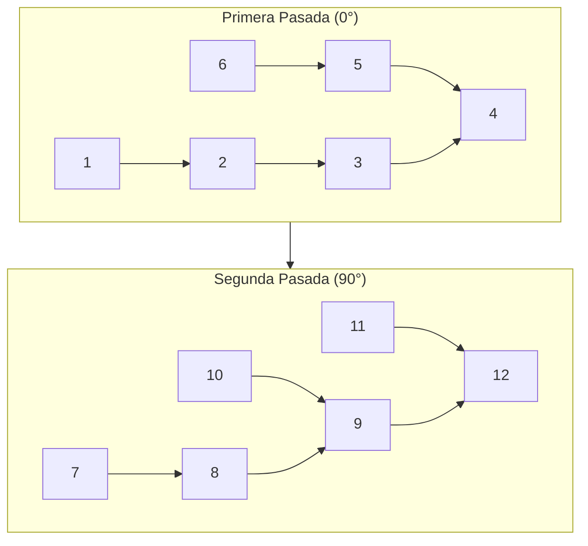

```
   Primera Pasada (0°)           Segunda Pasada (90°)
   ┌──────────────────┐          ┌──────────────────┐
   │  →  →  →  →  →   │          │  ↓     ↓     ↓   │
   │  ←  ←  ←  ←  ←   │    +     │  ↓     ↓     ↓   │
   │  →  →  →  →  →   │          │  ↓     ↓     ↓   │
   └──────────────────┘          └──────────────────┘
```

**Ventajas:**
- Cobertura en dos direcciones
- Mejor texturizado 3D
- ~2× waypoints que grid simple

---

### 3. Corridor (Corredor)

Líneas paralelas siguiendo una característica lineal (carreteras, ríos, tuberías).

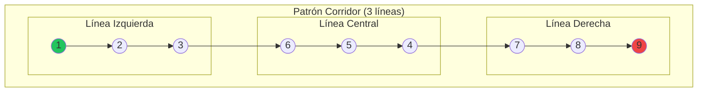

```
          Corredor de 3 líneas
   ┌─────────────────────────────────┐
   │   ← ← ← ← ← ← ← Línea Izq      │
   │                                 │
   │   → → → → → → → Línea Central  │
   │                                 │
   │   ← ← ← ← ← ← ← Línea Der      │
   └─────────────────────────────────┘
```

**Modos de entrada:**
1. **Desde polígono:** Extrae línea central del rectángulo mínimo
2. **Desde centerline:** Usa línea central explícita + ancho

**Parámetros:**
- `num_lines`: 1-5 líneas paralelas
- `corridor_width_m`: Ancho del corredor

---

### 4. Orbit (Órbita)

Círculos concéntricos alrededor de una estructura. Ideal para torres, edificios, monumentos.

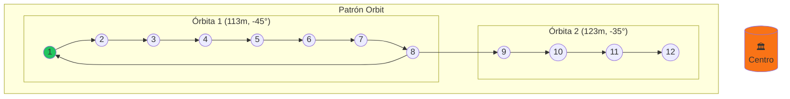

```
            Vista Superior
        ┌─────────────────────┐
        │     . . . . .       │
        │   .    ___    .     │
        │  .   /     \   .    │
        │ .   |   X   |   .   │  X = Centro
        │  .   \ ___ /   .    │      (estructura)
        │   .           .     │
        │     . . . . .       │
        └─────────────────────┘

        Vista Lateral (3 órbitas)
        ┌─────────────────────┐
        │  Órbita 3 ──────────│  133m, pitch -25°
        │  Órbita 2 ──────────│  123m, pitch -35°
        │  Órbita 1 ──────────│  113m, pitch -45°
        │        ▲            │
        │        │            │
        │    [Estructura]     │
        └─────────────────────┘
```

**Parámetros:**
- `num_orbits`: 1-5 órbitas concéntricas
- `photos_per_orbit`: 24 (default = 15° entre fotos)
- `altitude_step_m`: 10m incremento entre órbitas
- `start_gimbal_pitch`: -45° inicial
- Gimbal aumenta 10° por órbita

**Cálculo de posición:**
```
x = center_x + radius × sin(angle)
y = center_y + radius × cos(angle)
heading = (angle + 180) % 360  // Apunta al centro
```

---

## Diagrama de Patrones Comparativo

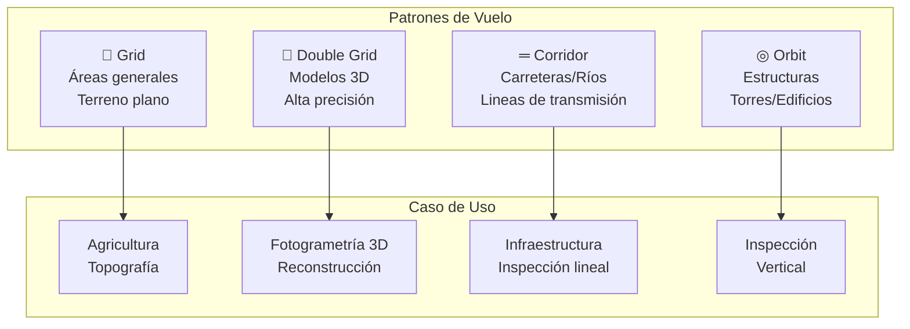

---

## Frontend (React + TypeScript)

### Componentes

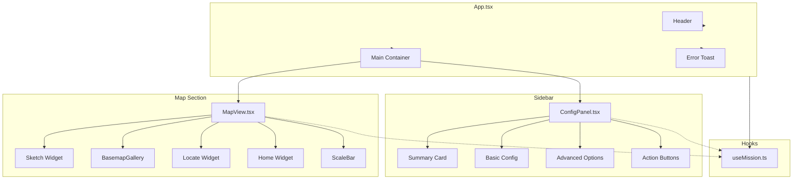

### Estados del Hook useMission

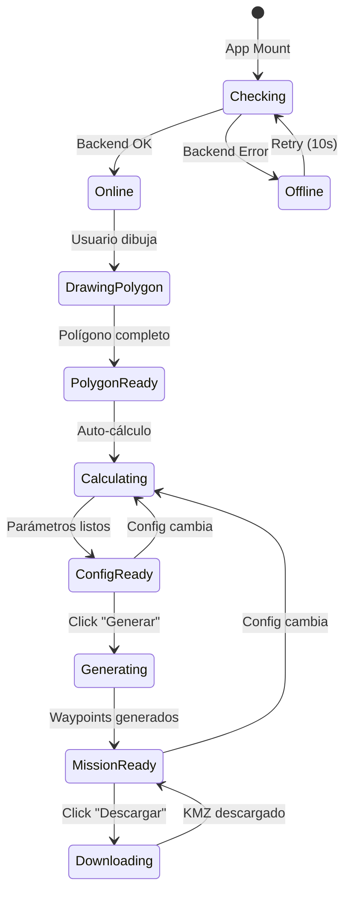

### Flujo de Estado

```mermaid
flowchart TB
    subgraph State["Estado Central (useMission)"]
        CONFIG[config: MissionConfig]
        PARAMS[flightParams: FlightParams]
        WP[waypoints: Waypoint[]]
        POLY[polygonCoords: Coordinate[]]
        AREA[areaSqM: number]
        STATUS[backendStatus]
        ERRORS[validationErrors]
    end

    subgraph Effects["Effects Automáticos"]
        E1["Effect: Health Check"]
        E2["Effect: Validación"]
        E3["Effect: Auto-cálculo"]
    end

    subgraph Actions["Acciones Usuario"]
        A1[updateConfig]
        A2[generateMission]
        A3[downloadKmz]
    end

    E1 -->|mount| STATUS
    E2 -->|config change| ERRORS
    E3 -->|params change| PARAMS

    A1 -->|actualiza| CONFIG
    A1 -->|limpia| WP

    A2 -->|genera| WP
    A2 -->|actualiza| PARAMS

    A3 -->|descarga| KMZ[Archivo KMZ]
```

---

### Servicios API

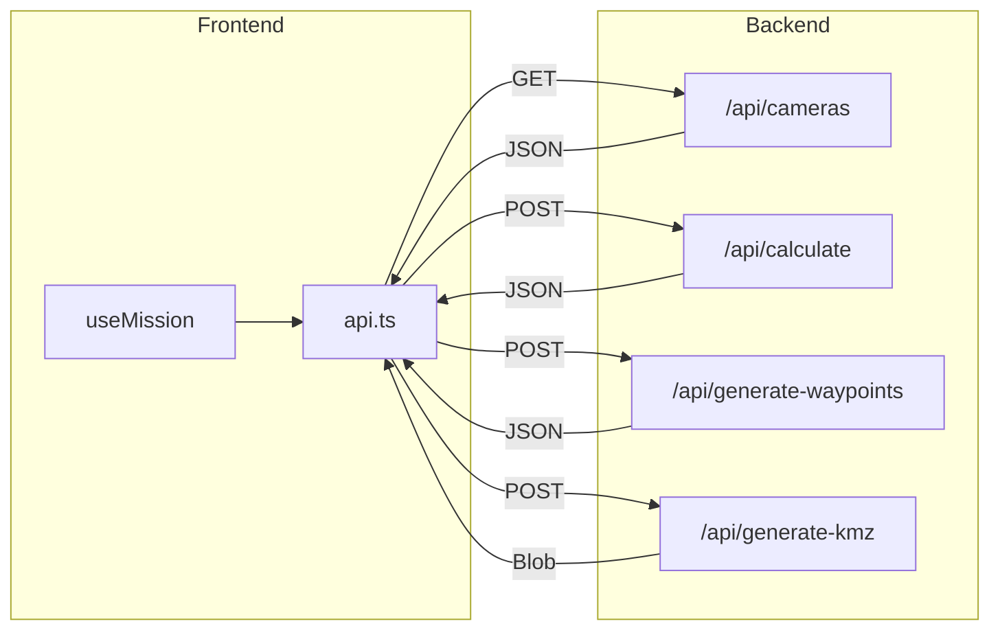

---

## Parámetros Fotogramétricos

### Relaciones entre Parámetros

```mermaid
flowchart TD
    GSD[GSD Objetivo<br/>cm/px] --> ALT[Altitud<br/>metros]
    ALT --> FOOT[Footprint<br/>ancho × alto]

    FOOT --> PS[Photo Spacing]
    FOOT --> LS[Line Spacing]

    FO[Front Overlap %] --> PS
    SO[Side Overlap %] --> LS

    PS --> SPEED[Max Speed<br/>m/s]
    MODE[48MP Mode] --> INT[Photo Interval<br/>2s / 5s]
    INT --> SPEED

    subgraph Override["Overrides Manuales"]
        ALT_O[Altitude Override] -.->|recalcula| GSD_R[GSD Real]
        SPEED_O[Speed Override] -.->|cap max| SPEED
    end

    ALT_O --> ALT

    style Override fill:#1a2332
```

### Tabla de Parámetros

| Parámetro | Rango | Default | Descripción |
|-----------|-------|---------|-------------|
| **GSD** | 0.5 - 5.0 cm/px | 2.0 | Resolución del terreno |
| **Front Overlap** | 50 - 90% | 75% | Solapamiento entre fotos consecutivas |
| **Side Overlap** | 50 - 90% | 65% | Solapamiento entre líneas |
| **Flight Angle** | 0 - 359° | 0° | Dirección del patrón (N=0°) |
| **48MP Mode** | on/off | off | Modo alta resolución (intervalo 5s) |
| **Altitude Override** | 20 - 120 m | - | Altitud manual (recalcula GSD) |
| **Speed Override** | 1 - 15 m/s | - | Velocidad manual (cap por intervalo) |
| **Gimbal Pitch** | -90° a 0° | -90° | Ángulo de cámara (nadir a horizonte) |

---

## Formato DJI WPML

### Estructura del Archivo KMZ

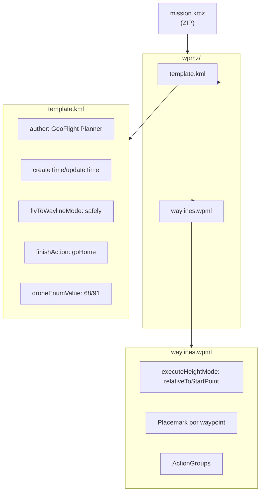

### Acciones por Waypoint

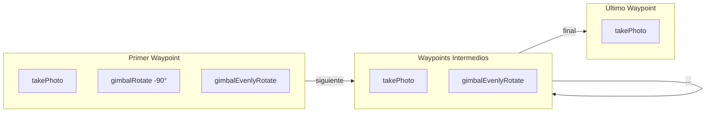

---

## Instalación y Configuración

### Requisitos

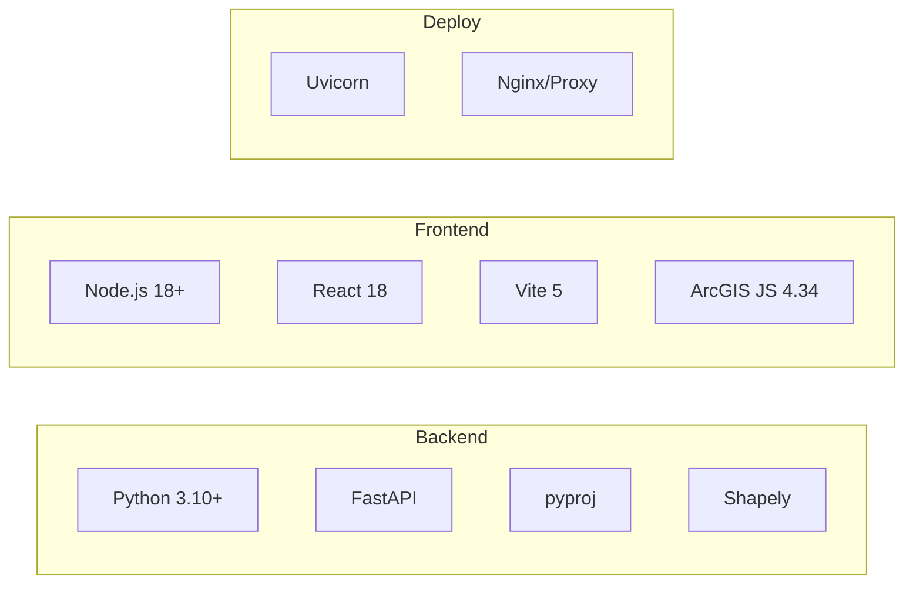

### Comandos

**Backend:**
```bash
cd geoflight/backend
python -m venv venv
venv\Scripts\activate          # Windows
pip install -r requirements.txt
uvicorn app.main:app --reload  # http://localhost:8000
```

**Frontend:**
```bash
cd geoflight/frontend
npm install
npm run dev                    # http://localhost:5173
```

### Variables de Entorno

| Variable | Default | Descripción |
|----------|---------|-------------|
| `DEBUG` | true | Modo debug |
| `CORS_ORIGINS` | localhost:5173 | Orígenes permitidos |

---

## Límites y Restricciones

| Restricción | Valor | Nota |
|-------------|-------|------|
| Max waypoints | **99** | Límite DJI Fly |
| GSD mínimo | 0.5 cm/px | Alta resolución |
| GSD máximo | 5.0 cm/px | Baja resolución |
| Overlaps | 50-90% | Rango válido |
| Intervalo 12MP | 2.0 s | Fijo |
| Intervalo 48MP | 5.0 s | Fijo |
| Altitud recomendada | ≤ 120 m | Regulaciones |

---

## Licencia

MIT License

---

*Documentación generada automáticamente - GeoFlight Planner v1.0.0*
