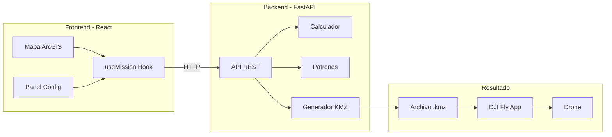
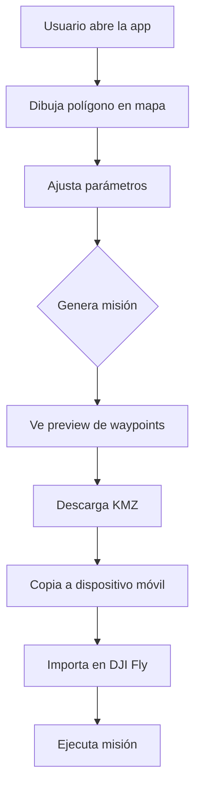
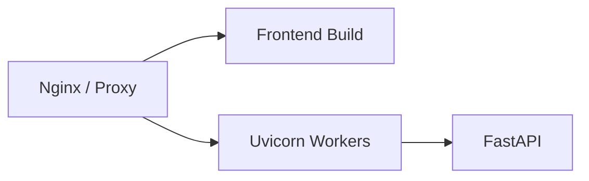
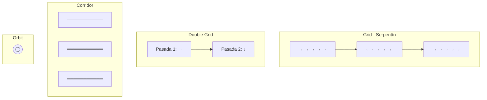
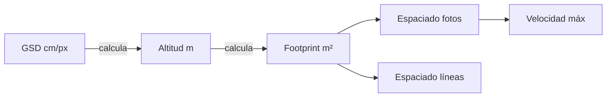

# GeoFlight Planner

Sistema web de planificación de vuelos fotogramétricos para drones DJI Mini 4 Pro y Mini 5 Pro. Genera archivos KMZ compatibles con DJI Fly.

---

## Objetivo

Permitir a usuarios sin conocimiento técnico en fotogrametría planificar misiones de vuelo profesionales:

1. Dibujar un área de interés en el mapa
2. Ajustar parámetros simples (resolución, solapamiento)
3. Obtener un archivo KMZ listo para volar

---

## Arquitectura



---

## Flujo de Uso



---

## Estructura del Proyecto

```
geoflight/
├── backend/                 # API Python
│   ├── app/
│   │   ├── main.py          # Endpoints FastAPI
│   │   ├── models.py        # Modelos Pydantic
│   │   ├── calculator.py    # Cálculos fotogramétricos
│   │   ├── config.py        # Configuración
│   │   ├── patterns/        # Generadores de patrones
│   │   │   ├── grid.py      # Patrón serpentín
│   │   │   ├── double_grid.py
│   │   │   ├── corridor.py
│   │   │   └── orbit.py
│   │   ├── wpml_builder.py  # Genera XML para DJI
│   │   └── kmz_packager.py  # Empaqueta KMZ
│   ├── tests/
│   └── requirements.txt
│
├── frontend/                # UI React
│   ├── src/
│   │   ├── components/
│   │   │   ├── Map/         # Mapa interactivo
│   │   │   └── ConfigPanel/ # Controles
│   │   ├── hooks/
│   │   │   └── useMission.ts
│   │   ├── services/
│   │   │   └── api.ts
│   │   └── types/
│   ├── package.json
│   └── vite.config.ts
│
└── README.md
```

---

## Despliegue

### Desarrollo Local

**1. Backend**

```bash
cd geoflight/backend
python -m venv venv

# Windows
venv\Scripts\activate

# Linux/Mac
source venv/bin/activate

pip install -r requirements.txt
uvicorn app.main:app --reload --host 0.0.0.0 --port 8000
```

**2. Frontend**

```bash
cd geoflight/frontend
npm install
npm run dev
```

**3. Acceder**

- Frontend: http://localhost:5173
- Backend API: http://localhost:8000
- Documentación API: http://localhost:8000/docs

### Producción



**Build frontend:**

```bash
cd geoflight/frontend
npm run build
# Resultado en dist/
```

**Ejecutar backend en producción:**

```bash
cd geoflight/backend
uvicorn app.main:app --host 0.0.0.0 --port 8000 --workers 4
```

---

## Patrones de Vuelo



| Patrón | Uso | Descripción |
|--------|-----|-------------|
| **Grid** | Ortofotomosaico, agricultura | Líneas paralelas en zigzag |
| **Double Grid** | Modelos 3D, reconstrucción | Dos pasadas perpendiculares |
| **Corridor** | Carreteras, ríos, tuberías | Líneas paralelas al eje largo |
| **Orbit** | Torres, edificios, monumentos | Círculos concéntricos |

---

## Parámetros

### Principales

| Parámetro | Rango | Default | Descripción |
|-----------|-------|---------|-------------|
| GSD | 0.5-5.0 cm/px | 2.0 | Resolución del terreno |
| Overlap Frontal | 50-90% | 75% | Solapamiento entre fotos |
| Overlap Lateral | 50-90% | 65% | Solapamiento entre líneas |
| Ángulo | 0-359° | 0° | Dirección de vuelo |

### Avanzados

| Parámetro | Descripción |
|-----------|-------------|
| Override Altitud | Fija altitud manual, recalcula GSD |
| Override Velocidad | Fija velocidad manual |
| Gimbal Pitch | Ángulo cámara (-90° nadir) |
| Acción Final | RTH, Aterrizar, Hover |

### Relación de Parámetros



---

## API Reference

| Método | Endpoint | Descripción |
|--------|----------|-------------|
| GET | `/api/cameras` | Lista drones soportados |
| POST | `/api/calculate` | Calcula parámetros de vuelo |
| POST | `/api/generate-waypoints` | Genera waypoints |
| POST | `/api/generate-kmz` | Descarga archivo KMZ |
| GET | `/health` | Estado del servidor |

---

## Cómo Modificar

### Agregar un Nuevo Drone

1. **Backend** - Editar `backend/app/models.py`:

```python
# En CAMERA_PRESETS agregar:
"nuevo_drone": CameraSpec(
    name="DJI Nuevo Drone",
    sensor_width_mm=9.59,
    sensor_height_mm=7.19,
    focal_length_mm=6.72,
    image_width_px=8064,
    image_height_px=6048,
    drone_enum_value=XX,      # Valor DJI
    payload_enum_value=XX,    # Valor DJI
)

# En DroneModel enum agregar:
class DroneModel(str, Enum):
    NUEVO_DRONE = "nuevo_drone"
```

2. **Frontend** - Editar `frontend/src/types/index.ts`:

```typescript
export type DroneModel = 'mini_4_pro' | 'mini_5_pro' | 'nuevo_drone';
```

### Agregar un Nuevo Patrón de Vuelo

1. Crear archivo en `backend/app/patterns/nuevo_patron.py`
2. Heredar de `PatternGenerator` (base.py)
3. Implementar método `generate()`
4. Registrar en `main.py`
5. Agregar al enum `FlightPattern` en models.py
6. Agregar botón en `ConfigPanel.tsx`

### Modificar Cálculos Fotogramétricos

Archivo: `backend/app/calculator.py`

```python
class PhotogrammetryCalculator:
    def gsd_to_altitude(self, gsd_cm):
        # Fórmula: altitude = (GSD × focal × img_width) / (sensor_width × 100)

    def calculate_footprint(self, altitude_m):
        # Área que cubre una foto a esa altitud

    def calculate_spacing(self, altitude_m, front_overlap, side_overlap):
        # Distancia entre fotos y entre líneas
```

### Modificar UI del Mapa

Archivo: `frontend/src/components/Map/MapView.tsx`

- Widgets ArcGIS: Sketch, Home, Locate, BasemapGallery, ScaleBar
- Capas gráficas: sketch, route, waypoints, labels

### Modificar Panel de Configuración

Archivo: `frontend/src/components/ConfigPanel/ConfigPanel.tsx`

- Sliders, toggles, selectores
- Validaciones en `useMission.ts`

---

## Formato KMZ

```
mission.kmz (ZIP)
└── wpmz/
    ├── template.kml    # Metadatos misión
    └── waylines.wpml   # Waypoints ejecutables
```

### Instalar en Drone

1. Descargar archivo `.kmz`
2. Copiar a: `/Android/data/dji.go.v5/files/waypoint/`
3. DJI Fly → Waypoint → Importar

---

## Limitaciones

| Restricción | Valor | Nota |
|-------------|-------|------|
| Max waypoints | 99 | Límite DJI Fly |
| Intervalo 12MP | 2s | Fijo |
| Intervalo 48MP | 5s | Fijo |
| Altitud recomendada | ≤120m | Regulaciones |

---

## Drones Soportados

| Modelo | droneEnumValue | payloadEnumValue |
|--------|----------------|------------------|
| DJI Mini 4 Pro | 68 | 52 |
| DJI Mini 5 Pro | 91 | 80 |

---

## Tests

```bash
# Backend
cd geoflight/backend
pytest

# Frontend lint
cd geoflight/frontend
npm run lint
```

---

## Stack Tecnológico

- **Backend**: Python 3.10+, FastAPI, Shapely, PyProj
- **Frontend**: React 18, TypeScript, Vite, ArcGIS JS 4.34
- **Formato salida**: DJI WPML/KMZ

---

## Licencia

MIT
