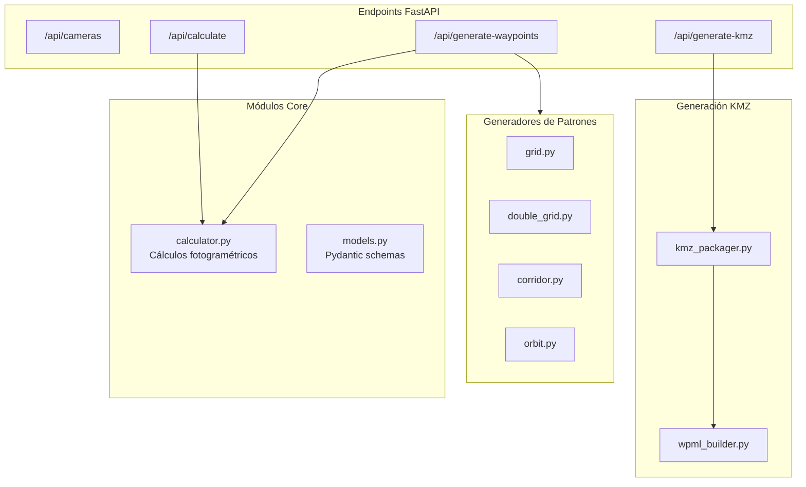

# GeoFlight Planner - Backend

API REST con FastAPI para planificación de vuelos fotogramétricos con drones DJI.

---

## Arquitectura



---

## Instalación

```bash
# Crear entorno virtual
python -m venv venv

# Activar (Windows)
venv\Scripts\activate

# Activar (Linux/Mac)
source venv/bin/activate

# Instalar dependencias
pip install -r requirements.txt

# Ejecutar servidor
uvicorn app.main:app --reload --port 8000
```

**URLs disponibles:**
- API: http://localhost:8000
- Documentación Swagger: http://localhost:8000/docs
- Documentación ReDoc: http://localhost:8000/redoc

---

## API Endpoints

| Método | Endpoint | Descripción |
|--------|----------|-------------|
| GET | `/api/cameras` | Lista drones/cámaras disponibles |
| POST | `/api/calculate` | Calcula parámetros de vuelo |
| POST | `/api/generate-waypoints` | Genera waypoints según patrón |
| POST | `/api/generate-kmz` | Genera y descarga archivo KMZ |
| GET | `/health` | Health check |

### Ejemplo: Generar Waypoints

```bash
curl -X POST http://localhost:8000/api/generate-waypoints \
  -H "Content-Type: application/json" \
  -d '{
    "polygon": {
      "coordinates": [
        {"longitude": -74.0721, "latitude": 4.7110},
        {"longitude": -74.0715, "latitude": 4.7110},
        {"longitude": -74.0715, "latitude": 4.7105},
        {"longitude": -74.0721, "latitude": 4.7105}
      ]
    },
    "drone_model": "mini_4_pro",
    "pattern": "grid",
    "target_gsd_cm": 2.0,
    "front_overlap_pct": 75,
    "side_overlap_pct": 65
  }'
```

---

## Estructura del Proyecto

```
backend/
├── app/
│   ├── main.py           # FastAPI app + endpoints
│   ├── config.py         # Configuración (CORS, límites)
│   ├── models.py         # Modelos Pydantic
│   ├── calculator.py     # Cálculos fotogramétricos
│   ├── patterns/         # Generadores de patrones
│   │   ├── base.py       # Clase base (transformaciones UTM)
│   │   ├── grid.py       # Patrón serpentín
│   │   ├── double_grid.py# Doble pasada perpendicular
│   │   ├── corridor.py   # Corredor lineal
│   │   └── orbit.py      # Órbita circular
│   ├── wpml_builder.py   # Genera XML WPML para DJI
│   └── kmz_packager.py   # Empaqueta KMZ (ZIP)
├── tests/
│   └── test_api.py
└── requirements.txt
```

---

## Módulos Principales

### calculator.py

Calcula parámetros fotogramétricos:

```python
# Fórmulas principales
altitude = (GSD × focal × img_width) / (sensor_width × 100)
footprint = (sensor / focal) × altitude
photo_spacing = footprint_height × (1 - front_overlap)
line_spacing = footprint_width × (1 - side_overlap)
max_speed = photo_spacing / photo_interval
```

### patterns/

Generadores de patrones de vuelo:

| Archivo | Patrón | Descripción |
|---------|--------|-------------|
| `grid.py` | Grid | Líneas paralelas en serpentín |
| `double_grid.py` | Double Grid | Dos pasadas perpendiculares |
| `corridor.py` | Corridor | Líneas paralelas al eje largo |
| `orbit.py` | Orbit | Círculos concéntricos |

Todos heredan de `base.py` que maneja transformaciones WGS84 ↔ UTM.

### wpml_builder.py

Genera archivos XML en formato DJI WPML:
- `template.kml`: Metadatos de la misión
- `waylines.wpml`: Waypoints ejecutables con acciones

### kmz_packager.py

Empaqueta los XML en un archivo KMZ (ZIP):
```
mission.kmz
└── wpmz/
    ├── template.kml
    └── waylines.wpml
```

---

## Tests

```bash
# Ejecutar todos los tests
pytest

# Tests específicos
pytest tests/test_api.py

# Tests con pattern matching
pytest -k "test_calculate"

# Con cobertura
pytest --cov=app
```

---

## Configuración

Archivo: `app/config.py`

| Variable | Default | Descripción |
|----------|---------|-------------|
| `CORS_ORIGINS` | localhost:5173 | Orígenes permitidos |
| `MAX_WAYPOINTS` | 99 | Límite DJI Fly |
| `MIN_INTERVAL_12MP` | 2.0s | Intervalo foto 12MP |
| `MIN_INTERVAL_48MP` | 5.0s | Intervalo foto 48MP |

---

## Agregar Nuevo Drone

1. Editar `models.py`:

```python
# En CAMERA_PRESETS
"nuevo_drone": CameraSpec(
    name="DJI Nuevo Drone",
    sensor_width_mm=9.59,
    sensor_height_mm=7.19,
    focal_length_mm=6.72,
    image_width_px=8064,
    image_height_px=6048,
    drone_enum_value=XX,
    payload_enum_value=XX,
)

# En DroneModel enum
class DroneModel(str, Enum):
    NUEVO_DRONE = "nuevo_drone"
```

---

## Agregar Nuevo Patrón

1. Crear `app/patterns/nuevo_patron.py`:

```python
from .base import PatternGenerator

class NuevoPatternGenerator(PatternGenerator):
    def generate(self, polygon_coords, **kwargs):
        # Implementar lógica
        # Retornar lista de Waypoint
        pass
```

2. Registrar en `main.py`:

```python
from app.patterns.nuevo_patron import NuevoPatternGenerator

# En el endpoint generate-waypoints
if request.pattern == FlightPattern.NUEVO:
    generator = NuevoPatternGenerator(flight_params, request.flight_angle_deg)
```

3. Agregar al enum en `models.py`:

```python
class FlightPattern(str, Enum):
    NUEVO = "nuevo"
```

---

## Dependencias

- **FastAPI**: Framework web
- **Pydantic**: Validación de datos
- **Shapely**: Operaciones geométricas
- **PyProj**: Transformaciones de coordenadas
- **Uvicorn**: Servidor ASGI

---

## Producción

```bash
# Múltiples workers
uvicorn app.main:app --host 0.0.0.0 --port 8000 --workers 4

# Con Gunicorn
gunicorn app.main:app -w 4 -k uvicorn.workers.UvicornWorker
```
