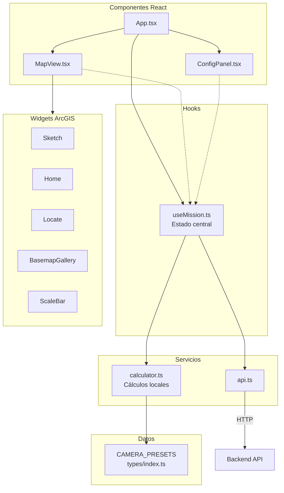
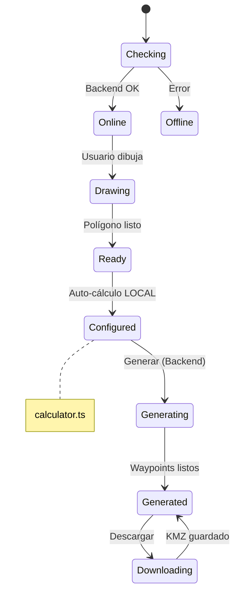
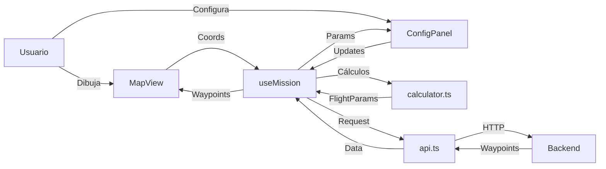

# GeoFlight Planner - Frontend

Interfaz web React + TypeScript con mapas ArcGIS para planificación de vuelos fotogramétricos.

---

## Arquitectura



> **Nota:** Los cálculos fotogramétricos (GSD, altitud, footprint, spacing) se ejecutan localmente en `calculator.ts`. El backend solo se usa para generar waypoints y KMZ.

---

## Instalación

```bash
# Instalar dependencias
npm install

# Servidor de desarrollo
npm run dev

# Build de producción
npm run build

# Lint
npm run lint
```

**URLs:**
- Desarrollo: http://localhost:5173
- El backend debe estar en: http://localhost:8000

---

## Estructura del Proyecto

```
frontend/
├── src/
│   ├── App.tsx              # Componente principal
│   ├── App.css              # Estilos globales
│   ├── main.tsx             # Entry point
│   │
│   ├── components/
│   │   ├── Map/
│   │   │   ├── MapView.tsx  # Mapa ArcGIS + widgets
│   │   │   ├── MapView.css
│   │   │   └── index.ts
│   │   │
│   │   └── ConfigPanel/
│   │       ├── ConfigPanel.tsx  # Panel de configuración
│   │       ├── ConfigPanel.css
│   │       └── index.ts
│   │
│   ├── hooks/
│   │   └── useMission.ts    # Hook de estado central
│   │
│   ├── services/
│   │   ├── api.ts           # Cliente API (waypoints, KMZ)
│   │   └── calculator.ts    # Cálculos fotogramétricos locales
│   │
│   └── types/
│       └── index.ts         # Tipos + CAMERA_PRESETS
│
├── index.html
├── package.json
├── tsconfig.json
└── vite.config.ts
```

---

## Componentes

### App.tsx

Componente raíz que integra MapView y ConfigPanel.

```tsx
<div className="app">
  <header>GeoFlight Planner</header>
  <main>
    <MapView />      // Mapa interactivo
    <ConfigPanel />  // Panel lateral
  </main>
</div>
```

### MapView.tsx

Mapa interactivo con ArcGIS JS API 4.34.

**Widgets incluidos:**
| Widget | Función |
|--------|---------|
| Sketch | Dibujar polígono/rectángulo |
| Home | Volver a vista inicial |
| Locate | GPS del usuario |
| BasemapGallery | Cambiar mapa base |
| ScaleBar | Escala métrica |

**Capas gráficas:**
- `sketchLayer`: Polígono dibujado
- `routeLayer`: Línea de ruta
- `waypointsLayer`: Marcadores de waypoints
- `labelsLayer`: Etiquetas INICIO/FIN

### ConfigPanel.tsx

Panel de configuración de misión.

**Secciones:**
1. **Summary**: Área, waypoints, distancia, tiempo estimado
2. **Configuración básica**: Drone (Mini 5 Pro default), patrón, GSD (1cm default), overlaps, ángulo
3. **Opciones avanzadas**:
   - Altitud manual
   - Gimbal: presets Nadir (-90°) / Oblicua (-45°) + slider
   - Modo Timer: intervalo de foto, velocidad, simplificación
4. **Parámetros calculados**: Altitud, velocidad, footprint, espaciados (calculados localmente)
5. **Acciones**: Generar misión, descargar KMZ

**Modo Timer:**
- Permite usar el timer de fotos de DJI Fly en lugar de waypoints por foto
- Calcula overlap real basado en `velocidad × intervalo`
- Muestra velocidad óptima para el overlap deseado
- Habilita simplificación de waypoints (fusiona segmentos colineales)

---

## Hook useMission

Estado central de la aplicación.



> **Nota:** El cálculo de parámetros (`FlightParams`) es automático y local - no requiere backend. Solo "Generar" y "Descargar" llaman al servidor.

**Estados:**
```typescript
config          // MissionConfig - parámetros del usuario
flightParams    // FlightParams - calculados localmente (calculator.ts)
waypoints       // Waypoint[] - puntos generados por backend
polygonCoords   // Coordinate[] - vértices del polígono
areaSqM         // number - área en m²
backendStatus   // 'checking' | 'online' | 'offline'
validationErrors // string[] - errores de validación
simplificationStats // Estadísticas de simplificación
```

**Funciones:**
- `updateConfig()`: Actualiza configuración
- `generateMission()`: Genera waypoints
- `downloadKmz()`: Descarga archivo KMZ

---

## Servicios

### calculator.ts (Local - Sin Backend)

```typescript
// Cálculos fotogramétricos ejecutados en el navegador
calculateFlightParams(params) // GSD, altitud, footprint, spacing, speed
```

**Fórmulas principales:**
- Altitud = `(GSD × focal × img_width) / (sensor_width × 100)`
- Footprint = `(sensor / focal) × altitude`
- Photo Spacing = `footprint_height × (1 - front_overlap)`
- Max Speed = `photo_spacing / photo_interval`

### api.ts (Backend)

```typescript
// Endpoints que requieren backend
generateWaypoints(req) // POST /api/generate-waypoints
downloadKmz(req)       // POST /api/generate-kmz
```

> **Nota:** `getCameras()` y `calculateParams()` fueron eliminados. Las specs de cámara están en `CAMERA_PRESETS` y los cálculos en `calculator.ts`.

---

## Tipos TypeScript

Archivo: `types/index.ts`

```typescript
// Enums
type DroneModel = 'mini_4_pro' | 'mini_5_pro'
type FlightPattern = 'grid' | 'double_grid' | 'corridor' | 'orbit'
type FinishAction = 'goHome' | 'noAction' | 'autoLand' | 'gotoFirstWaypoint'

// Especificaciones de cámara (constante, no API)
const CAMERA_PRESETS: Record<DroneModel, CameraSpec> = {
  mini_4_pro: {
    sensor_width_mm: 9.59,    // 1/1.3" sensor
    sensor_height_mm: 7.19,
    focal_length_mm: 6.72,
    image_width_px: 8064,     // 48MP
    image_height_px: 6048,
    // ...
  },
  mini_5_pro: {
    sensor_width_mm: 13.20,   // 1" sensor
    sensor_height_mm: 8.80,
    focal_length_mm: 8.82,
    image_width_px: 8192,     // 50MP
    image_height_px: 6144,
    // ...
  },
}

// Interfaces principales
interface MissionConfig {
  droneModel: DroneModel
  pattern: FlightPattern
  targetGsdCm: number          // Default: 1.0
  frontOverlapPct: number      // Default: 75
  sideOverlapPct: number       // Default: 65
  flightAngleDeg: number
  use48mp: boolean
  gimbalPitchDeg: number       // -90 (nadir) o -45 (oblicua)
  // Timer mode
  useTimerMode: boolean
  photoIntervalS: number       // 2-10s
  speedMs: number              // 1-15 m/s
  // Simplificación
  useSimplify: boolean
  simplifyAngleThreshold: number
}

interface FlightParams {
  altitude_m: number
  gsd_cm_px: number
  footprint_width_m: number
  footprint_height_m: number
  line_spacing_m: number
  photo_spacing_m: number
  max_speed_ms: number
  // Timer mode calculations
  actual_speed_ms?: number
  actual_photo_spacing_m?: number
  actual_front_overlap_pct?: number
}

interface Waypoint {
  index: number
  longitude: number
  latitude: number
  altitude: number
  heading: number
  gimbal_pitch: number
  speed: number
  take_photo: boolean
}
```

---

## Estilos

**Paleta de colores (CSS Variables):**

```css
--bg: #0B0F14           /* Fondo */
--surface: #111827      /* Paneles */
--primary: #F97316      /* Naranja DJI */
--success: #22C55E      /* Verde */
--warning: #F59E0B      /* Amarillo */
--error: #EF4444        /* Rojo */
```

---

## Flujo de Datos



> Los cálculos de `FlightParams` se ejecutan localmente al cambiar la configuración. El backend solo se llama al generar waypoints o descargar KMZ.

---

## Modificar UI

### Agregar nuevo parámetro

1. Agregar a `types/index.ts`:
```typescript
interface MissionConfig {
  nuevoParametro: number
}
```

2. Agregar default en `DEFAULT_MISSION_CONFIG`

3. Agregar control en `ConfigPanel.tsx`:
```tsx
<input
  type="range"
  value={config.nuevoParametro}
  onChange={(e) => onConfigChange({ nuevoParametro: Number(e.target.value) })}
/>
```

### Agregar nuevo widget al mapa

Editar `MapView.tsx`:
```tsx
import NewWidget from '@arcgis/core/widgets/NewWidget'

// En useEffect de inicialización
const newWidget = new NewWidget({ view })
view.ui.add(newWidget, 'top-right')
```

---

## Build y Producción

```bash
# Build
npm run build

# Resultado en dist/
# Servir con cualquier servidor estático
npx serve dist
```

**Configuración Vite** (`vite.config.ts`):
```typescript
export default defineConfig({
  plugins: [react()],
  server: {
    proxy: {
      '/api': 'http://localhost:8000'
    }
  }
})
```

---

## Dependencias Principales

- **React 18**: UI framework
- **TypeScript**: Tipado estático
- **Vite**: Build tool
- **@arcgis/core 4.34**: Mapas interactivos
- **ESLint**: Linting
