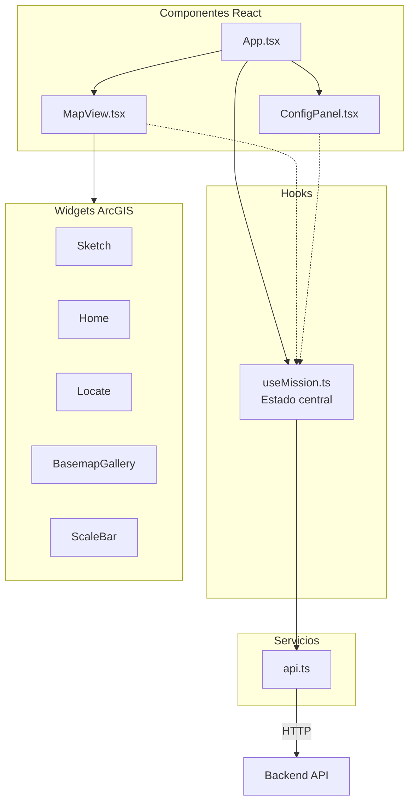
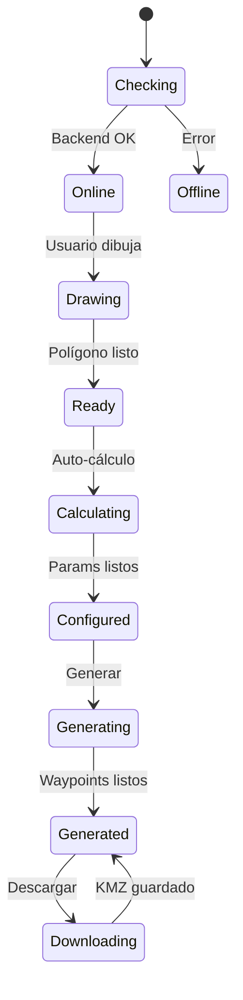
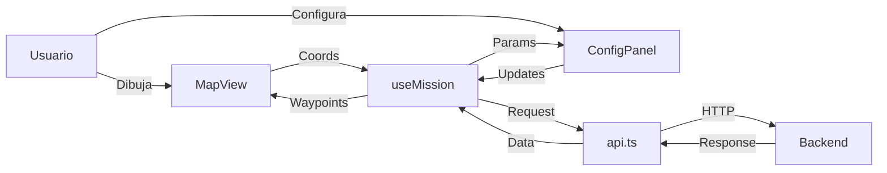

# GeoFlight Planner - Frontend

Interfaz web React + TypeScript con mapas ArcGIS para planificación de vuelos fotogramétricos.

---

## Arquitectura



---

## Instalación

```bash
# Instalar dependencias
npm install

# Servidor de desarrollo
npm run dev

# Build de producción
npm run build

# Lint
npm run lint
```

**URLs:**
- Desarrollo: http://localhost:5173
- El backend debe estar en: http://localhost:8000

---

## Estructura del Proyecto

```
frontend/
├── src/
│   ├── App.tsx              # Componente principal
│   ├── App.css              # Estilos globales
│   ├── main.tsx             # Entry point
│   │
│   ├── components/
│   │   ├── Map/
│   │   │   ├── MapView.tsx  # Mapa ArcGIS + widgets
│   │   │   ├── MapView.css
│   │   │   └── index.ts
│   │   │
│   │   └── ConfigPanel/
│   │       ├── ConfigPanel.tsx  # Panel de configuración
│   │       ├── ConfigPanel.css
│   │       └── index.ts
│   │
│   ├── hooks/
│   │   └── useMission.ts    # Hook de estado central
│   │
│   ├── services/
│   │   └── api.ts           # Cliente API
│   │
│   └── types/
│       └── index.ts         # Tipos TypeScript
│
├── index.html
├── package.json
├── tsconfig.json
└── vite.config.ts
```

---

## Componentes

### App.tsx

Componente raíz que integra MapView y ConfigPanel.

```tsx
<div className="app">
  <header>GeoFlight Planner</header>
  <main>
    <MapView />      // Mapa interactivo
    <ConfigPanel />  // Panel lateral
  </main>
</div>
```

### MapView.tsx

Mapa interactivo con ArcGIS JS API 4.34.

**Widgets incluidos:**
| Widget | Función |
|--------|---------|
| Sketch | Dibujar polígono/rectángulo |
| Home | Volver a vista inicial |
| Locate | GPS del usuario |
| BasemapGallery | Cambiar mapa base |
| ScaleBar | Escala métrica |

**Capas gráficas:**
- `sketchLayer`: Polígono dibujado
- `routeLayer`: Línea de ruta
- `waypointsLayer`: Marcadores de waypoints
- `labelsLayer`: Etiquetas INICIO/FIN

### ConfigPanel.tsx

Panel de configuración de misión.

**Secciones:**
1. **Summary**: Área, waypoints, fotos, tiempo estimado
2. **Configuración básica**: Drone, patrón, GSD, overlaps, ángulo
3. **Opciones avanzadas**: Override altitud/velocidad, gimbal, acción final
4. **Parámetros calculados**: Altitud, velocidad, footprint, espaciados
5. **Acciones**: Generar misión, descargar KMZ

---

## Hook useMission

Estado central de la aplicación.



**Estados:**
```typescript
config          // MissionConfig - parámetros del usuario
flightParams    // FlightParams - calculados por backend
waypoints       // Waypoint[] - puntos generados
polygonCoords   // Coordinate[] - vértices del polígono
areaSqM         // number - área en m²
backendStatus   // 'checking' | 'online' | 'offline'
validationErrors // string[] - errores de validación
```

**Funciones:**
- `updateConfig()`: Actualiza configuración
- `generateMission()`: Genera waypoints
- `downloadKmz()`: Descarga archivo KMZ

---

## Servicios API

Archivo: `services/api.ts`

```typescript
// Endpoints
getCameras()           // GET /api/cameras
calculateParams(req)   // POST /api/calculate
generateWaypoints(req) // POST /api/generate-waypoints
downloadKmz(req)       // POST /api/generate-kmz
```

---

## Tipos TypeScript

Archivo: `types/index.ts`

```typescript
// Enums
type DroneModel = 'mini_4_pro' | 'mini_5_pro'
type FlightPattern = 'grid' | 'double_grid' | 'corridor' | 'orbit'
type FinishAction = 'goHome' | 'noAction' | 'autoLand' | 'gotoFirstWaypoint'

// Interfaces principales
interface MissionConfig {
  droneModel: DroneModel
  pattern: FlightPattern
  targetGsdCm: number
  frontOverlapPct: number
  sideOverlapPct: number
  flightAngleDeg: number
  use48mp: boolean
  // ... más campos
}

interface FlightParams {
  altitude_m: number
  gsd_cm_px: number
  footprint_width_m: number
  footprint_height_m: number
  line_spacing_m: number
  photo_spacing_m: number
  max_speed_ms: number
  // ...
}

interface Waypoint {
  index: number
  longitude: number
  latitude: number
  altitude: number
  heading: number
  gimbal_pitch: number
  speed: number
  take_photo: boolean
}
```

---

## Estilos

**Paleta de colores (CSS Variables):**

```css
--bg: #0B0F14           /* Fondo */
--surface: #111827      /* Paneles */
--primary: #F97316      /* Naranja DJI */
--success: #22C55E      /* Verde */
--warning: #F59E0B      /* Amarillo */
--error: #EF4444        /* Rojo */
```

---

## Flujo de Datos



---

## Modificar UI

### Agregar nuevo parámetro

1. Agregar a `types/index.ts`:
```typescript
interface MissionConfig {
  nuevoParametro: number
}
```

2. Agregar default en `DEFAULT_MISSION_CONFIG`

3. Agregar control en `ConfigPanel.tsx`:
```tsx
<input
  type="range"
  value={config.nuevoParametro}
  onChange={(e) => onConfigChange({ nuevoParametro: Number(e.target.value) })}
/>
```

### Agregar nuevo widget al mapa

Editar `MapView.tsx`:
```tsx
import NewWidget from '@arcgis/core/widgets/NewWidget'

// En useEffect de inicialización
const newWidget = new NewWidget({ view })
view.ui.add(newWidget, 'top-right')
```

---

## Build y Producción

```bash
# Build
npm run build

# Resultado en dist/
# Servir con cualquier servidor estático
npx serve dist
```

**Configuración Vite** (`vite.config.ts`):
```typescript
export default defineConfig({
  plugins: [react()],
  server: {
    proxy: {
      '/api': 'http://localhost:8000'
    }
  }
})
```

---

## Dependencias Principales

- **React 18**: UI framework
- **TypeScript**: Tipado estático
- **Vite**: Build tool
- **@arcgis/core 4.34**: Mapas interactivos
- **ESLint**: Linting
